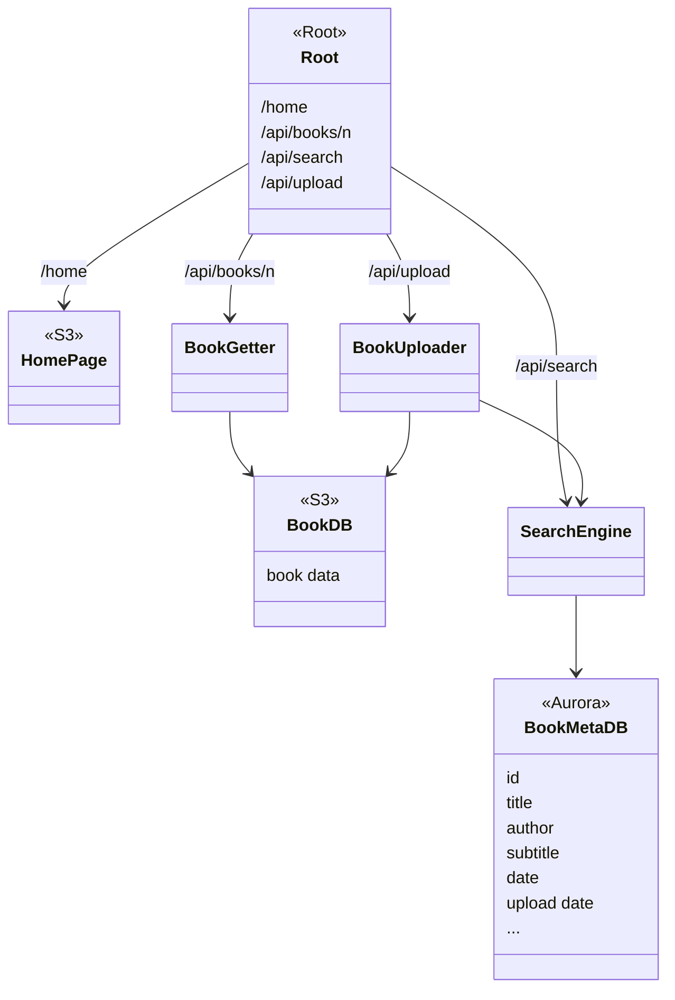

<!--
SPDX-FileCopyrightText: 2022 perillamint

SPDX-License-Identifier: CC0-1.0
-->

## Architecture

```mermaid
classDiagram


class Root {
    <<Root>>
    /home
    /api/books/n
    /api/search
    /api/upload
}

Root --> Home Page : /home
<<S3>> Home Page


Root --> Book Getter : /api/books/n
Book Getter --> Book DB
class Book DB {
    <<S3>>
    book data
}

Root --> Search Engine : /api/search
Search Engine --> Book Meta DB

class Book Meta DB {
    <<Aurora>>
    id
    title
    author
    subtitle
    date
    upload date
    ...
}

Root --> Book Uploader : /api/upload

Book Uploader --> Book DB
Book Uploader --> Search Engine


```

TODO: OIDC + Redis account Checking
